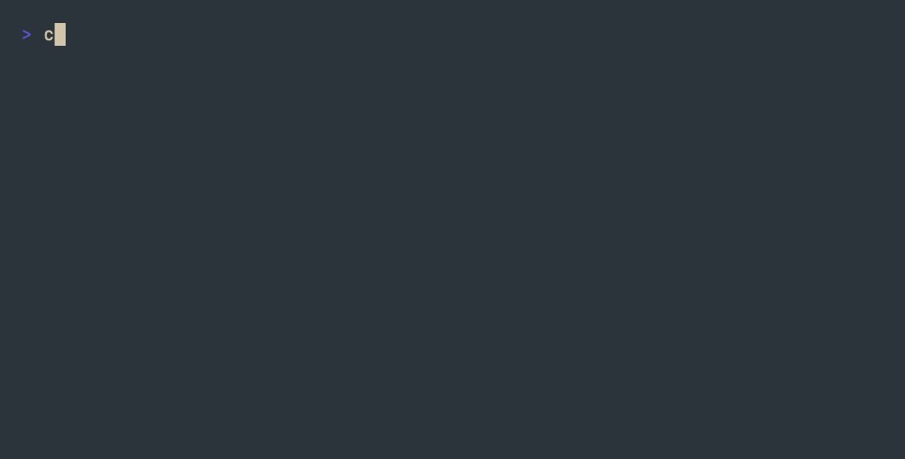

# cadence

A terminal CLI for [Garmin Connect](https://connect.garmin.com) — training readiness, sleep, HRV, body battery, activities, VO2 Max, training status, and more.

The Garmin Connect API is undocumented and requires emulating the official mobile app's auth flow. `cadence` does the full SSO + OAuth1 + OAuth2 dance from scratch with zero external auth dependencies — no `garth` or `garmy` required.



```
$ cadence tr
Training Readiness — last 7 days

Date        Score  Level     Sleep  HRV  Recovery  Load  Stress
──────────  ─────  ────────  ─────  ───  ────────  ────  ──────
2026-05-03  72     HIGH      88     67   75        72    62
2026-05-04  81     HIGH      92     74   85        78    71
2026-05-05  44     LOW       62     45   48        65    35
2026-05-06  63     MODERATE  78     58   65        70    55
2026-05-07  79     HIGH      88     71   82        76    68
2026-05-08  85     PRIME     95     78   88        82    75
2026-05-09  82     HIGH      91     75   85        80    71

$ cadence ts
Training Status — last 7 days

Date        Status      Focus          Acute  Chronic  ACWR  VO2
──────────  ──────────  ─────────────  ─────  ───────  ────  ────
2026-05-09  PRODUCTIVE  HIGH_AEROBIC   456    421      1.08  52.3
```

## Requirements

- macOS (uses Keychain for credential storage)
- [Bun](https://bun.sh) ≥ 1.3.9 — uses the native `Bun.secrets` keychain API
- A [Garmin Connect](https://connect.garmin.com) account with at least one synced device
- **MFA must be disabled** — or use the `import-tokens` workflow (see below)

## Install

```bash
git clone https://github.com/serhiitroinin/cadence.git
cd cadence
bun install
bun run build
ln -s "$PWD/dist/cadence" /usr/local/bin/cadence
```

Or run directly: `bun run src/cli.ts tr`

## First-time setup

```bash
cadence login your@email.com YourGarminPassword
```

This performs the full Garmin SSO flow:
1. Fetches OAuth1 consumer credentials from `thegarth.s3.amazonaws.com/oauth_consumer.json`
2. Establishes SSO cookies + grabs a CSRF token from `sso.garmin.com`
3. Submits credentials → receives a one-time `ticket`
4. Exchanges the ticket for an OAuth1 token (HMAC-SHA1 signed)
5. Exchanges the OAuth1 token for an OAuth2 access + refresh token

OAuth1 tokens last ~1 year; OAuth2 access tokens last 24h and auto-refresh on every API call.

### MFA / import existing tokens

If your account has MFA enabled, the inline `login` flow will fail. Workaround: log in with a Python tool like [garth](https://github.com/matin/garth) or [garmy](https://github.com/atomicdesigner/garmy) which support MFA, then import:

```bash
cadence import-tokens               # reads ~/.garmy by default
cadence import-tokens ~/.garth      # or any other directory
```

This reads `oauth1_token.json` + `oauth2_token.json` and copies them into Keychain. After that, `cadence` runs standalone — the source directory isn't needed again.

## Commands

### Auth

| Command | Description |
|---|---|
| `cadence login <email> <pw>` | Full SSO + OAuth login |
| `cadence import-tokens [dir]` | One-shot migration from garth/garmy |
| `cadence status` | Token validity + expiry |
| `cadence logout` | Wipe all credentials |

### Core health (default: 7 days)

| Command | Aliases | Description |
|---|---|---|
| `cadence overview [days]` |  | Full dashboard — all metrics in one view |
| `cadence training-readiness [days]` | `tr` | Score + 5 contributing factors |
| `cadence sleep [days]` |  | Score, stages, total duration |
| `cadence heart-rate [days]` | `hr` | RHR, min/max, 7-day average |
| `cadence hrv [days]` |  | Nightly + weekly avg, baseline, status |
| `cadence stress [days]` |  | Avg/max stress + qualifier |
| `cadence body-battery [days]` | `bb` | Charge, drain, high, low, at-wake |
| `cadence steps [days]` |  | Steps, distance, goal, floors |
| `cadence activities [days]` |  | Recent workouts |
| `cadence daily [days]` |  | Combined daily summary |

### Advanced

| Command | Aliases | Description |
|---|---|---|
| `cadence vo2max [days]` |  | Running + cycling VO2 Max (default: 30 days) |
| `cadence spo2 [days]` |  | Sleep blood oxygen |
| `cadence respiration [days]` | `resp` | Waking + sleeping breath rates |
| `cadence training-status [days]` | `ts` | Status, load focus, ACWR |
| `cadence race-predictions` | `rp` | Predicted 5K/10K/Half/Marathon times |
| `cadence weight [days]` |  | Body composition (default: 30 days) |
| `cadence fitness-age` | `fa` | Fitness age vs chronological age |
| `cadence intensity [days]` | `im` | Moderate + vigorous minutes |
| `cadence endurance` | `es` | Endurance score + classification |

### Activity drill-down

| Command | Aliases | Description |
|---|---|---|
| `cadence activity <id>` |  | Summary + splits + HR zones for one activity |
| `cadence records` | `prs` | Personal records |
| `cadence gear` |  | Equipment usage |

### Raw API

| Command | Description |
|---|---|
| `cadence json <path> [k=v ...]` | Raw JSON from any Garmin Connect endpoint |

## Metric reference

### Training readiness (0–100)

| Range | Level | Meaning |
|---|---|---|
| 75–100 | HIGH/PRIME | Body ready, push hard |
| 50–74 | MODERATE | Normal training OK |
| 25–49 | LOW | Reduce intensity, focus recovery |
| 0–24 | POOR | Rest day recommended |

Factors (each 0–100): sleep, hrv, recovery, load, stress.

### Body battery (0–100)

`75–100` high · `50–74` moderate · `25–49` low · `0–24` very low

### Stress (0–100)

`0–25` rest · `26–50` low · `51–75` medium · `76–100` high

### Training status

| Status | Meaning |
|---|---|
| `PEAKING` | Ideal race form |
| `PRODUCTIVE` | Fitness improving |
| `MAINTAINING` | Fitness stable |
| `RECOVERY` | Light load, recovering |
| `UNPRODUCTIVE` | Load not improving fitness |
| `DETRAINING` | Load too low, fitness declining |
| `OVERREACHING` | Load too high, overtraining risk |

### ACWR (Acute:Chronic Workload Ratio)

`<0.8` undertraining · `0.8–1.3` sweet spot · `>1.5` danger zone

### VO2 Max (ml/kg/min)

`<30` low · `30–39` fair · `40–49` good · `50–59` excellent · `60+` elite

### Aerobic / Anaerobic Training Effect (0.0–5.0)

`0.0–0.9` none · `1.0–1.9` minor · `2.0–2.9` maintaining · `3.0–3.9` improving · `4.0–4.9` highly improving · `5.0` overreaching

## Credentials & security

Stored in macOS Keychain under service `cadence`:

- `consumer-key`, `consumer-secret` — OAuth1 consumer (cached from public URL)
- `oauth1-token`, `oauth1-secret` — long-lived OAuth1 (~1 year)
- `access-token`, `refresh-token`, `expires-at`, `refresh-expires-at` — OAuth2
- `display-name`, `profile-pk` — cached profile lookups

Inspect: `security find-generic-password -s cadence -a access-token -w`

Wipe: `cadence logout`

## Disclaimer

This tool is **not** affiliated with, endorsed by, or supported by Garmin Ltd. "Garmin", "Garmin Connect", and "Garmin Index" are trademarks of Garmin Ltd. The Garmin Connect API used here is undocumented and unofficial; this tool may break if Garmin changes it.

Use at your own risk and within Garmin's Terms of Service.

## License

MIT
